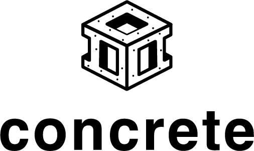

<div align="center">


# The Concrete Programming Language
[](https://github.com/unbalancedparentheses/concrete2/actions/workflows/lean_action_ci.yml)
[![Telegram Chat][tg-badge]][tg-url]
[](/LICENSE)

[tg-badge]: https://img.shields.io/endpoint?url=https%3A%2F%2Ftg.sumanjay.workers.dev%2Fconcrete_proglang%2F&logo=telegram&label=chat&color=neon
[tg-url]: https://t.me/concrete_proglang

</div>

> Most ideas come from previous ideas — Alan C. Kay, *The Early History Of Smalltalk*

**A small systems language with linear types, no GC, and a compiler written in Lean — so that the same kernel that compiles your code can check theorems about it.**

Concrete combines Rust-like ownership, Zig-like explicit systems control, Austral-like capability discipline, and Lean 4 kernel-checked proofs. It is not a proof assistant; it is a no-GC systems language Lean can reason about. The compiler is written in Lean 4 and the long-term aim is to prove selected compiler properties in the same kernel — but that work is gated, see "Where Concrete is honest" below.

## Where Concrete sits

| | Rust | Zig | SPARK / Ada | Lean 4 | Austral | **Concrete** |
|---|:-:|:-:|:-:|:-:|:-:|:-:|
| No GC | ✓ | ✓ | ✓ | ✗ | ✓ | **✓** |
| Linear types | ⚠ borrow-checker | ✗ | ✗ | ✗ | ✓ | **✓** |
| Capability-visible effects | ✗ | ✗ | ⚠ contracts | ✗ | ✓ | **✓** |
| Kernel-checked user proofs | ✗ | ✗ | ✓ (SMT) | ✓ | ✗ | **✓ (Lean)** |
| Compiler written in same kernel | ✗ | ✗ | ✗ | n/a | ✗ | **✓** |
| Systems target | ✓ | ✓ | ✓ | ✗ | ✓ | **✓** |

The empty cell is the bet: no GC + linear + capability-visible effects + kernel-checked user proofs + compiler written in the same kernel + systems target.

## What Others Can Do

Concrete is not claiming every piece is unique. The unusual part is the
combination.

- **Rust / Zig / C / C++** are great systems languages, but proofs are mostly external. You can test, fuzz, use sanitizers, or model-check pieces, but the compiler does not normally track "this function has a theorem attached and the theorem drifted when the body changed."
- **SPARK / Ada, Dafny, F*, Why3** have strong verification stories, but they are not trying to feel like a small C/Rust/Zig-style systems language with Lean as the compiler/proof substrate.
- **Lean / Coq / Isabelle** are excellent proof systems, but writing normal low-level systems code there is not the primary path.
- **Austral** is closer on linear types and safety, but it does not have the same Lean-backed proof/evidence pipeline.

Concrete's useful bet is: systems-language shape, compiler-enforced discipline,
Lean-backed theorem attachment, drift gates, and evidence bundles in one toolchain.

## The Thesis

Most systems languages give you safety **or** control. Concrete is trying to make four things visible at the function boundary:

1. **what authority** a function has (capabilities)
2. **whether it allocates, blocks, recurses, or runs unboundedly** (predictable-execution profile)
3. **where it crosses trust boundaries** (`trusted`, `unsafe`)
4. **whether those claims are reported, enforced, or proved**

A reviewer should be able to audit a function from its signature plus the compiler's reports, without reading the implementation and without trusting convention. That same discipline makes the code unusually legible to LLM tools — the model can ask the compiler what code is allowed to do instead of guessing from source.

## The Language

- **No garbage collector.** Memory is managed through ownership and borrowing, checked at compile time. No runtime GC, no hidden reference counting.
- **Linear type system.** Every non-`Copy` value must be consumed exactly once. Programs that leak, double-free, or use-after-move are rejected.
- **Copy vs linear.** Types are `Copy` (integers, small structs that opt in) or linear (heap-owning by default).
- **Capability-based effects.** Side effects are declared in signatures: `with(File)`, `with(Console)`, `with(Alloc)`. A function with no capabilities is pure — no I/O, no allocation, no FFI.
- **Predictable-execution profile.** The compiler can reject functions that recurse, allocate, block, cross FFI, or run unbounded loops. Per-function, not whole-program.
- **Explicit trust boundaries.** `trusted` marks code the compiler cannot fully verify (pointer arithmetic, FFI). Everything else is checked. The boundary is visible.
- **Lean-backed proofs.** Selected pure functions can carry Lean 4 theorems. `make build` runs the kernel; drift in source revokes the `proved` evidence automatically.

## What This Looks Like

The first graduated flagship, [examples/parse_validate](examples/parse_validate/), is the example to read first.  Its [`README.md`](examples/parse_validate/README.md) follows the honest framing the rest of the project tries to live up to: what is proved, what is enforced (statically and by CI), what is reported, what is assumed, and **what is not yet done**.  Four later flagships ([crypto_verify](examples/crypto_verify/), [fixed_capacity](examples/fixed_capacity/), [constant_time_tag](examples/constant_time_tag/), [hmac_sha256](examples/hmac_sha256/)) reuse the same template across different systems domains.

For the minimal effects-report shape, here is [examples/thesis_demo](examples/thesis_demo/src/main.con):

```con
fn parse_byte(data: Int, offset: Int) -> Int { return data + offset; }
fn check_length(len: Int) -> Int { if len < 10 { return 1; } return 0; }

fn validate(data: Int, len: Int) -> Int {
    if check_length(len) != 0 { return 1; }
    let mut checksum: Int = 0;
    for (let mut i: Int = 0; i < len; i = i + 1) {
        checksum = checksum + parse_byte(data, i);
    }
    if checksum == 0 { return 2; }
    return 0;
}

fn report(result: Int) with(Console) {
    if result == 0 { println("ok"); } else { println("fail"); }
}

pub fn main() with(Std) -> Int {
    let result: Int = validate(42, 10);
    report(result);
    return result;
}
```

`concrete --report effects` on this file produces, today:

```
parse_byte     caps: (pure)     loops: no     evidence: proved
check_length   caps: (pure)     loops: no     evidence: proved
validate       caps: (pure)     loops: bounded evidence: enforced
report         caps: Console    loops: no     evidence: enforced
pub main       caps: File,Network,Clock,Env,Random,Process,Console,Alloc
                                              evidence: reported
```

Read the signatures. `parse_byte`, `check_length`, `validate` are pure. `report` can write to the console and nothing else. `main` has `Std` because it is the entry point. The split between bounded core and effectful shell is the point — Concrete does not pretend the whole program is predictable; it makes the boundary explicit.

## What the compiler reports

Evidence levels:

- **proved** — a linked Lean 4 theorem backs the claim.
- **enforced** — the compiler can reject violations (passes all 5 predictable gates).
- **reported** — the compiler classifies it but cannot enforce.
- **trusted-assumption** — claim depends on an explicit trust boundary.

The predictable profile (`--check predictable`) rejects functions that recurse, contain unbounded loops, allocate (or declare `Alloc`), cross FFI, or block through file/network/process capabilities. Per-function.

Reports that run cleanly today: `caps`, `unsafe`, `layout`, `interface`, `alloc`, `mono`, `authority`, `proof`, `eligibility`, `proof-status`, `obligations`, `stack-depth`, `fingerprints`, `effects`, `recursion`, `consistency`, `verify`.

## Where Concrete is honest

The README discipline this project tries to live up to: state what is true today, name what is not, do not sell harder than the AUDITs allow.

**The compiler is written in Lean 4. It is not yet proved in Lean 4.** That distinction matters. Phase 10 of the roadmap (the Compiler Soundness Bridge) is where compiler-correctness work happens; today the compiler is well-tested (1575 positive tests, drift-detection gates including the spec-drift gate that prevents typo'd specs from silently "proving," 5 graduated flagships' worth of oracle differentials totaling ~3000 cases) but not Lean-verified.  Every extraction rule (R-01…R-28) names the Phase 10 preservation obligation it creates; see `docs/PROOF_OBLIGATIONS_REGISTER.md`.  The 4-layer trust map: (1) Lean kernel checks the user's theorem; (2) Concrete compiler extracts the property — trusted; (3) LLVM/clang/linker — trusted; (4) host kernel + libc — trusted. See [docs/TRUSTED_COMPUTING_BASE.md](docs/TRUSTED_COMPUTING_BASE.md).

**"Every function provable" is the long-term aim, not the current state.** Today ProofCore covers integer/bool, if-then-else (including early-return desugaring), function calls, let-bindings, struct + enum literals, pattern matching, array reads and functional array updates, bounded `while` loops (flat-assign body, including array-element writes) and richer `while_step` loops (Cont/Break enum), casts, and width-tagged arithmetic/bitwise ops — `mod`/`div`, `bitand`/`bitor`/`bitxor`, logical `shl`/`shr`, and `u32` wrapping `add` — at i32/u32/u8 widths with signed and unsigned result modes (the HMAC-SHA256 forcing surface, R-22…R-28).  It does NOT yet cover references/borrows or arbitrary (non-counter) loop invariants.  **Refinement against an independent spec** is now demonstrated end to end. An independent `BitVec`-valued SHA-256/HMAC spec ships ([`Concrete/Sha256Spec.lean`](Concrete/Sha256Spec.lean)), and the **entire** extracted SHA-256/HMAC chain is proved to *refine* it for all inputs in the documented bounds — 11 registered theorems, kernel-checked (`--report check-proofs` = 11 verified, 0 failed), each tied to the exact extracted source through the spec-drift gate (the [hmac_sha256](examples/hmac_sha256/) flagship; see the dedicated paragraph below).  All of it lives in [`Concrete/Sha256Refine.lean`](Concrete/Sha256Refine.lean), and the reusable machinery it produced (fuel monotonicity + bounded counter-loop induction + array/BitVec/loop/call lemmas) was harvested into the `fns`-generic [`Concrete/ProofKit/*`](Concrete/ProofKit/) — see [docs/PROOFKIT_GUIDE.md](docs/PROOFKIT_GUIDE.md) and [docs/PROOF_LADDER.md](docs/PROOF_LADDER.md).  Per-construct register: `docs/PROOF_OBLIGATIONS_REGISTER.md`; mutation model: `docs/PROOF_STATE_MODEL.md`.

**Five graduated Phase 7 flagships as of 2026-06-02:**
- [parse_validate](examples/parse_validate/) — capability-pure validation core, Lean composition theorem, drift-enforced negative pair.
- [crypto_verify](examples/crypto_verify/) — toy proof-scaffolding for authenticated-tag verification (explicitly NOT real crypto).
- [fixed_capacity](examples/fixed_capacity/) — bounded ring buffer + message validator with iteration-counted composition theorem over mutable state.
- [constant_time_tag](examples/constant_time_tag/) — fixed-size byte-array comparison with universal same-tag theorem and honest machine-level-timing gap.
- [hmac_sha256](examples/hmac_sha256/) — first real cryptographic primitive (FIPS 180-4 + RFC 4231); the **entire** SHA-256/HMAC composition chain is kernel-verified (11 registered proofs) and every link is tied to the exact extracted source through the spec-drift gate.

Each is in `tests/showcase/manifest.toml` with 10 of 10 graduation bars met; `make test-showcase` walks all five and asserts CI gates + release bundle capture cleanly.

`hmac_sha256` (graduated 2026-06-02) is the deepest proof artifact: `hmac_sha256_refines_spec` proves the extracted body computes exactly an independent BitVec model (`Sha256Spec.hmac`) for all inputs in the documented bounds (`k_len ≤ 128`, `m_len ≤ 256`, `len ≤ 375`), composing nine full-contract chain refinements (block-to-words, schedule, round, single/offset compress, state serialization, multi-block padded hash, outer HMAC) by `eval_while_count` loop induction + `bv_decide` — not 64× unfolding. It realizes the thesis end to end: *source extracts to this ProofCore body, this body refines the spec, and drift breaks the claim.* The proof infrastructure was then harvested into a reusable, `fns`-generic **Proof Kit** (`Concrete/ProofKit/*`); the [docs/PROOFKIT_GUIDE.md](docs/PROOFKIT_GUIDE.md) teaches the path on `ch` → `block_to_words` → `state_to_bytes` → `sha256_compress` → `hmac_sha256`. See also [docs/PROOF_LADDER.md](docs/PROOF_LADDER.md).

**Async / concurrency / threads / channels are not implemented.** The research direction is documented (evidence-bearing structured concurrency, `with(Async)` vs `with(Concurrent)`, linear task handles, deterministic simulation as a future backend) but no code exists. See [research/stdlib-runtime/async-concurrency-evidence.md](research/stdlib-runtime/async-concurrency-evidence.md).

**Other things not implemented:** broad proof coverage, bounded-capacity types, incremental compilation, package manager / workspaces, second backend (QBE/WASM/etc.), LSP / editor support, REPL / playground. See [ROADMAP.md](ROADMAP.md) for priorities.

**The audience is narrow.** Systems engineers who want Lean-backed proofs on selected functions, willing to accept linearity discipline, working in a domain where no-GC matters. If you want broad memory safety with low ceremony, Rust is more mature. If you want fast iteration on low-level code without proof story, Zig is simpler. Concrete is for the case where all four of those constraints bind.

## Research Direction: Evidence-Bearing Concurrency

Sketched as future work; not in scope for the first release. The interesting target is not Rust-style async/await but **evidence-bearing structured concurrency**:

- `with(Async)` for order-independent work that may safely run sequentially
- `with(Concurrent)` for work requiring real concurrent progress for correctness
- structured scopes; child tasks cannot outlive their parent
- linear task handles; tasks cannot leak
- owned-value transfer instead of `Send` contagion
- bounded channels, race/select, cooperative cancellation only if they fit the linear/evidence model
- deterministic simulation as a future backend — scheduler bugs reproducible from a seed

`Async` vs `Concurrent` is the key distinction. If two operations are merely independent, sequential fallback is correct. If both must make progress or the program deadlocks, the type system should say so. "Missing concurrency" becomes a type-system issue, not a scheduler accident.

See [research/stdlib-runtime/async-concurrency-evidence.md](research/stdlib-runtime/async-concurrency-evidence.md).

## Try it

```bash
make build

# The pilot example — read its README first
.lake/build/bin/concrete examples/parse_validate/src/main.con --report effects
.lake/build/bin/concrete examples/parse_validate/src/main.con --report proof-status
.lake/build/bin/concrete examples/parse_validate/src/main.con --check predictable

# CI gates that enforce the showcase contract
make test-policy          # enforced budgets in Concrete.toml [policy]
make test-assumptions     # declared trust surface in assumptions.toml
make test-catches         # "Concrete catches this" negative cases
make test-verify-gates    # pass-by-pass compiler self-checks

# A simpler example
.lake/build/bin/concrete examples/thesis_demo/src/main.con --report effects
```

## Building

Requires [Lean 4](https://leanprover.github.io/lean4/doc/setup.html) (v4.28.0+) and clang.

```bash
make build
make test
make clean
```

## Doc Map

**Start here:** [examples/parse_validate/README.md](examples/parse_validate/README.md) — the first graduated flagship, with the honest framing template all five flagships share.

**Discipline:** [docs/WRONG_CODE_CORPUS.md](docs/WRONG_CODE_CORPUS.md), [docs/REDUCER_WORKFLOW.md](docs/REDUCER_WORKFLOW.md), [docs/BUG_BUNDLE.md](docs/BUG_BUNDLE.md), [docs/VERIFY_GATES.md](docs/VERIFY_GATES.md), [docs/ASSUMPTION_FILES.md](docs/ASSUMPTION_FILES.md), [docs/POLICY_FILES.md](docs/POLICY_FILES.md), [docs/INTERPRETER_TRUST.md](docs/INTERPRETER_TRUST.md).

**Identity / claims:** [docs/IDENTITY.md](docs/IDENTITY.md), [docs/PRINCIPLES.md](docs/PRINCIPLES.md), [docs/CLAIMS_TODAY.md](docs/CLAIMS_TODAY.md), [docs/PROOF_STORY_MATRIX.md](docs/PROOF_STORY_MATRIX.md), [docs/PROVABLE_V1.md](docs/PROVABLE_V1.md), [docs/TRUSTED_COMPUTING_BASE.md](docs/TRUSTED_COMPUTING_BASE.md), [docs/PROFILES.md](docs/PROFILES.md), [docs/INFLUENCES.md](docs/INFLUENCES.md).

**Proof system:** [docs/PROOFKIT_GUIDE.md](docs/PROOFKIT_GUIDE.md) ("prove your first Concrete function" — the reusable, `fns`-generic proof kit harvested from HMAC), [docs/PROOF_LADDER.md](docs/PROOF_LADDER.md) (discharge tiers + the shipped reusable proof layer), [docs/CONTRACTS_AND_VCS.md](docs/CONTRACTS_AND_VCS.md) (the planned claim→obligation→evidence→audit pipeline and source contracts), [docs/PROOF_OBLIGATIONS_REGISTER.md](docs/PROOF_OBLIGATIONS_REGISTER.md), [docs/PROOF_WORKFLOW.md](docs/PROOF_WORKFLOW.md).

**Direction:** [ROADMAP.md](ROADMAP.md), [CHANGELOG.md](CHANGELOG.md), [research/](research/).

## License

Concrete was originally specified and created by Federico Carrone at LambdaClass.

[Apache 2.0](/LICENSE)
