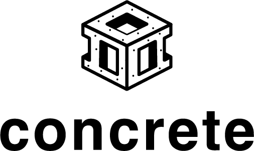

<div align="center">


# The Concrete Programming Language
[](https://github.com/unbalancedparentheses/concrete2/actions/workflows/lean_action_ci.yml)
[![Telegram Chat][tg-badge]][tg-url]
[](/LICENSE)

[tg-badge]: https://img.shields.io/endpoint?url=https%3A%2F%2Ftg.sumanjay.workers.dev%2Fconcrete_proglang%2F&logo=telegram&label=chat&color=neon
[tg-url]: https://t.me/concrete_proglang

</div>

**Concrete is a systems programming language without garbage collection that
checks resource ownership, makes external authority explicit in function
signatures, and supports machine-checked proofs for a defined subset of
code—with remaining assumptions made explicit.**

It compiles to native code. Linear ownership makes resource management explicit
and compiler-checked; its verification tools attach Lean-checked evidence to
supported code. Proofs, tests, runtime checks and trusted assumptions remain
distinct. The compiler itself is written in Lean 4.

**Status: experimental.** The language, standard library and tooling are still
evolving. Concrete is not a fully verified compiler, and a successful build is
not a proof that a program is correct. See [Claims Today](docs/verification/CLAIMS_TODAY.md)
for the guarantees and boundaries, and the [roadmap](ROADMAP.md) for planned work.

## A Small Example

This complete program writes a message, checks the write and close results, and
explicitly releases its resources. Save it as `hello/src/main.con`; the setup
commands are below.

```con project
mod hello {
    import std.io.{Writer, IoError, console_writer};

    // The helper declares the authority required by its writer.
    fn emit<cap C>(out: &Writer<C>, message: &String)
        with(C) -> Result<u64, IoError> {
        return out.write_str(message);
    }

    fn main() with(Console, Alloc) -> Int {
        let message: String = "Hello, Concrete!\n";
        let out: Writer<Console> = console_writer();

        let written: u64 = emit(&out, &message).unwrap_or(0);
        let complete: bool = written == message.len();
        message.drop();

        let closed: bool = out.close().is_ok();
        if complete && closed { return 0; }
        return 1;
    }
}
```

Three things are visible in the code:

- **Ownership:** `emit` borrows the writer and message. `main` owns them, so it
  must consume or transfer them. Here, `drop()` releases the string and `close()`
  consumes the writer. There is no implicit scope-exit destruction.
- **Authority:** `emit` requires its writer's capability `C`. With this console
  writer, that means `Console`. Removing `Console` from `main` is a compiler
  error; passing the writer through a helper does not hide the requirement.
  `Alloc` accounts for the allocated string.
- **Failure:** writing and closing return `Result`. This program exits with 1
  on a failed or short write, or a failed close. Closing happens even when the
  write fails.

The same helper can borrow a `Writer<File>` or a fixed-buffer `Writer<{}>`.
The required authority changes with the type; ownership and error handling
remain explicit.

## Try It

The repository provides a [Nix](https://nixos.org/download/) development shell
with Lean, clang and the supporting tools. From a terminal:

```bash
git clone https://github.com/unbalancedparentheses/concrete2.git
cd concrete2
nix --extra-experimental-features "nix-command flakes" develop
lake build
export PATH="$PWD/.lake/build/bin:$PATH"
```

If you already have Lean and clang installed, you can build outside Nix with
`lake build`. Use the exact Lean version in [lean-toolchain](lean-toolchain),
currently **4.28.0**, rather than an arbitrary newer version.

Create a project inside the checkout:

```bash
mkdir -p hello/src
cat > hello/Concrete.toml <<'EOF'
[package]
name = "hello"
version = "0.1.0"
EOF
```

Save the program above in `hello/src/main.con`, then run:

```bash
cd hello
concrete build . -o hello
./hello
concrete src/main.con --report caps
concrete src/main.con --report unsafe
```

The program prints `Hello, Concrete!`. The reports show declared authority and
its supporting assumptions and coverage. An incomplete report is not evidence
that no assumptions exist.

A manifest matters: standard-library imports use project mode. For the
standalone-file workflow, see
[Standalone File vs Project Mode](docs/project/STANDALONE_VS_PROJECT.md).
Run `concrete --help` for commands, or explore an existing program such as
[base64_cli](examples/base64_cli/src/main.con).

## What the Compiler Checks

| Concern | Concrete's approach |
| --- | --- |
| Resource ownership | Non-`Copy` values must be consumed or transferred; use after move and silent discard are rejected. |
| Borrowing | Safe references provide scoped access and cannot be returned from safe APIs. Mutable access is exclusive. |
| External authority | Callers declare the capabilities their calls require, including calls through capability-bearing handles and function pointers. |
| Cleanup | Explicit consuming calls, optionally scheduled with `defer`; failures abort rather than unwind. |
| Runtime safety | Safe indexing and ordinary integer arithmetic have bounds and overflow checks. Explicit wrapping and saturating operations have their named behavior. |
| Recoverable failure | APIs use values such as `Result`; failure paths must also respect ownership. |

A capability is an **allowance**, not a promise that every execution uses it.
`with(File)` does not identify a particular file or confine filesystem paths.
An empty capability set does not establish purity, termination, or functional
correctness: a function can still mutate an argument through `&mut`.

Foreign declarations are audited claims. A `trusted` body can discharge
`Unsafe` obligations, but must still declare its external authority. The
compiler checks callers against those declarations; it cannot prove a dishonest
C binding honest. Read the [FFI rules](docs/platform/FFI.md) and
[handle capability design](docs/language/HANDLE_CAPABILITIES.md) for the boundary.

## Contracts and Evidence

Contracts state properties to establish. For example:

```con
#[requires(0 <= i && i < 16)]
#[ensures(result == a[i])]
fn get16(a: [u8; 16], i: i32) -> u8 {
    return a[i];
}
```

The precondition is an obligation for callers. The postcondition states what the
function should return. Writing either annotation does not, by itself, prove it.
Concrete generates obligations and reports the evidence available for them.

| Evidence | What it tells you |
| --- | --- |
| Compiler enforcement | A structural check, such as ownership or capability checking, accepted the code. |
| Lean proof | A kernel checked a stated theorem about the supported formal model. |
| External solver result | A solver discharged an obligation; solver trust remains explicit unless independently replayed. |
| Oracle test | Executions agreed with a reference implementation on tested inputs. |
| Runtime check | A condition is checked when the program executes. |
| Assumption or trusted boundary | The conclusion relies on something outside the checked proof. |

**A theorem about extracted semantics is not an end-to-end proof of the native
binary.** Source-to-model correspondence, foreign code, the backend and the
runtime have their own boundaries. Missing, stale and incomplete evidence must
be read alongside successful results.

Start with the [verification status](docs/verification/VERIFICATION_STATUS.md)
and [proof semantics boundary](docs/verification/PROOF_SEMANTICS_BOUNDARY.md).
The [verification charter](docs/verification/VERIFICATION_CHARTER.md) describes
the longer-term direction separately from current support.

## Examples to Explore

| Example | What to look for |
| --- | --- |
| [Base64 CLI](examples/base64_cli/src/main.con) | Owned strings and bytes, explicit cleanup, and capability-bearing writers in a real program. |
| [Constant-time tag comparison](examples/constant_time_tag/) | Value-correctness proofs, with machine-level timing assumptions kept separate. |
| [HMAC/SHA-256](examples/hmac_sha256/) | Refinement proofs and independent oracle tests supporting different claims. |
| [Contract negatives](examples/contract_negatives/) | Invalid and unsupported claims that the tools must refuse. |
| [VC examples](examples/vc_suite/) | Bounds, arithmetic and contract obligations. |

The [example inventory](docs/project/EXAMPLE_INVENTORY.md) distinguishes tested
examples from exploratory workloads. The [documentation index](docs/README.md)
links the language, standard library, compiler and verification references.

## Development

Inside the development shell, from the repository root:

```bash
lake build
bash scripts/tests/run_tests.sh
bash scripts/tests/check_doc_snippets.sh
```

The full suite is substantial. For a focused change, consult the
[test guide](scripts/tests/README.md) for the relevant checks. Documentation code
blocks are checked too, including the project example in this README.

For the design rationale, read [Why Concrete?](docs/project/WHY_CONCRETE.md).
For current priorities and release plans, use the [roadmap](ROADMAP.md).
Questions and discussion are welcome in [Telegram][tg-url].

## License

Concrete was originally specified and created by Federico Carrone at LambdaClass.

[Apache 2.0](LICENSE)
